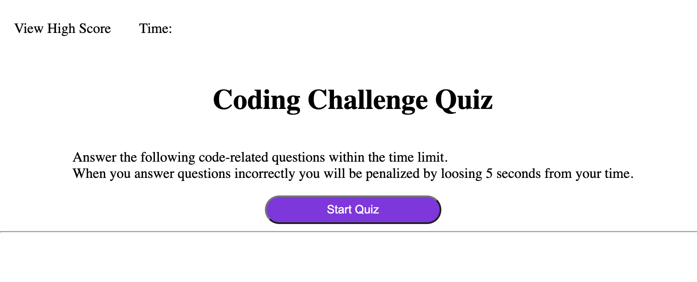
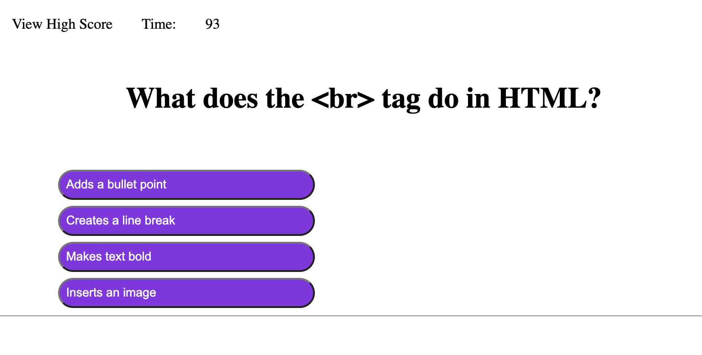
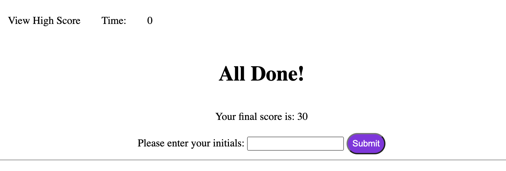

# coding_knowledge_quiz

## Description

A multiple choice quiz to help students who are studying computer science topics practice HTML, CSS, and JavaScript concepts.

Students will be presented with quesitons and a countdown time. For each question they answer correctly they will be given points, for each incorrect answer they will lose time from the countdown clock.

Creating this project I learned about getElementById, creating and calling functions in JavaScript, and local storage.

## Usage

Deployed URL: 

GitHub Repository URL: https://github.com/ahgeak/coding_knowledge_quiz 

To use this quiz, the student will click no the Start Quiz button.

They will then be presented with questions and answers. The student will select an answer and the program will let them know if they answered correctly or incorrectly. They will then be presented with a new question.

When either the time runs out or the student has answered all questions, they will be presented with their score and an area to input their intials.

## Credits

I used documentation from the mdn website at: https://developer.mozilla.org/en-US/

I reviewed lessons and practice exercises on W3Shools at: https://www.w3schools.com/

I attend office hours to ask the TA about the localStorage

## License

This project users an MIT liscene